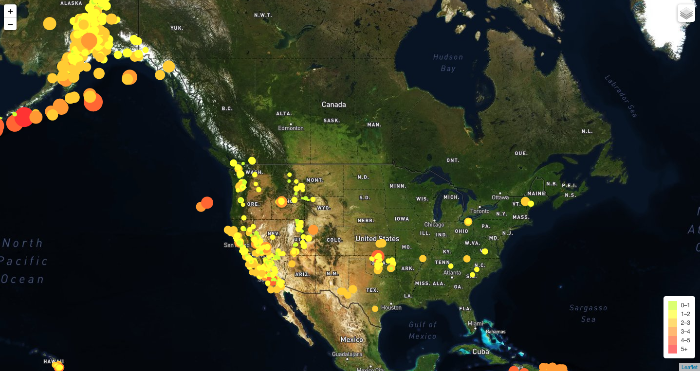

# Leaflet Homework: Visualizing Data with Leaflet

In this project, I have plotted earthquakes occurring globally using a live API feed provided by the USGS [USGS GeoJSON Feed](http://earthquake.usgs.gov/earthquakes/feed/v1.0/geojson.php) page. The data in the feed is updated every 5 mins, and includes all earthquake data for the Past 7 Days.

# Technology stack used in this project:
   * leaflet.js
   * HTML/CSS/Bootstrap/Javascript
   * GeoJSON
